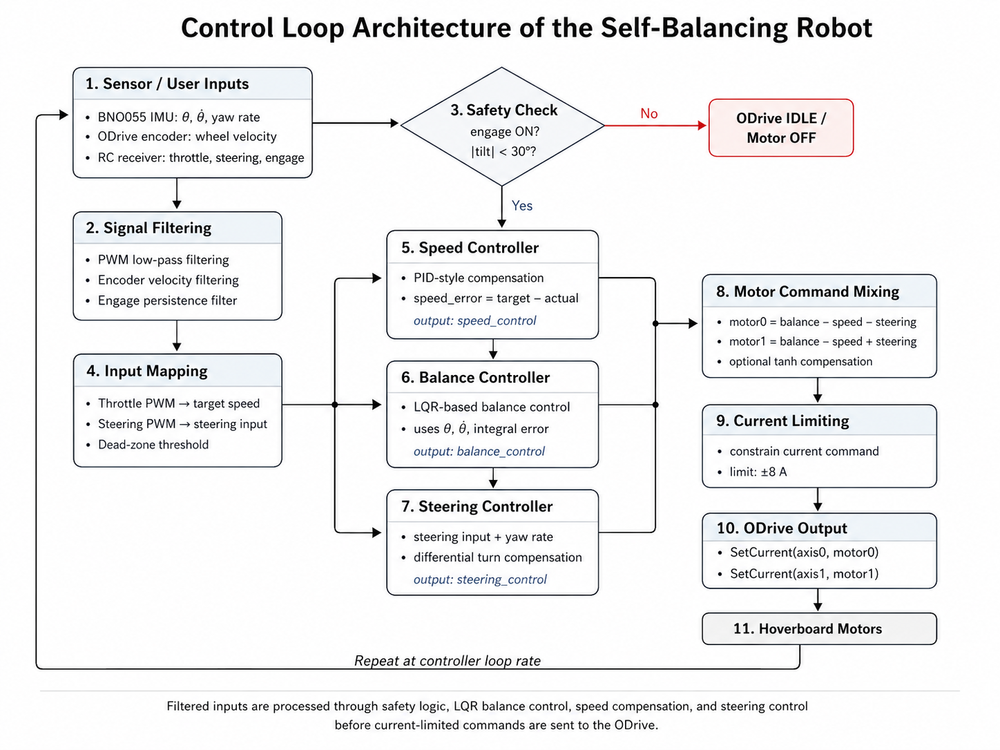
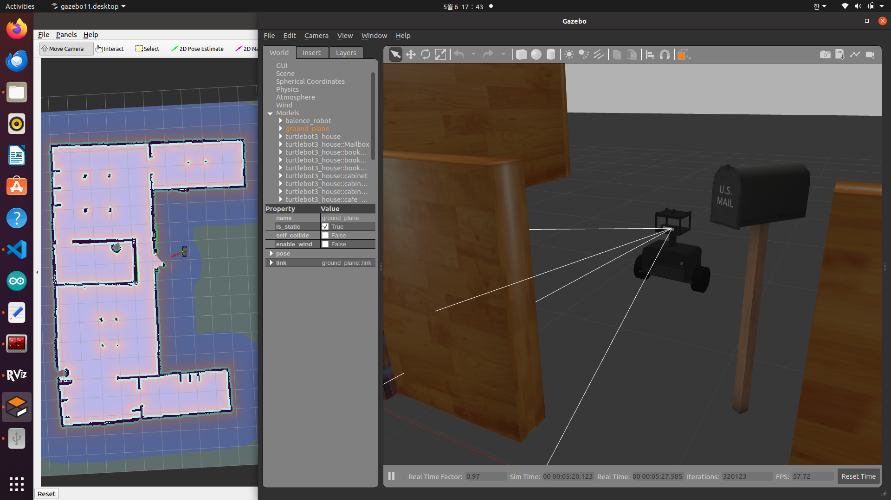
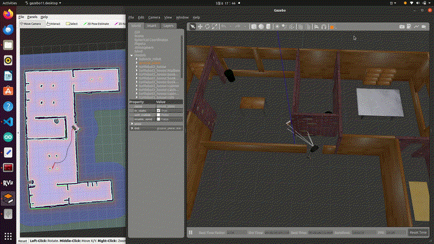
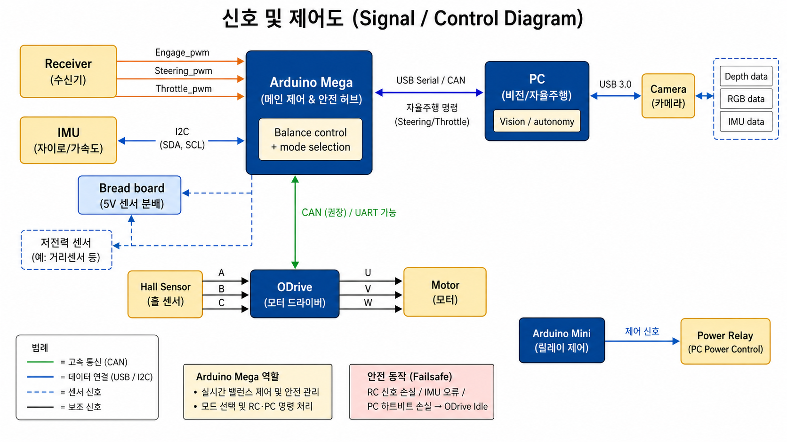
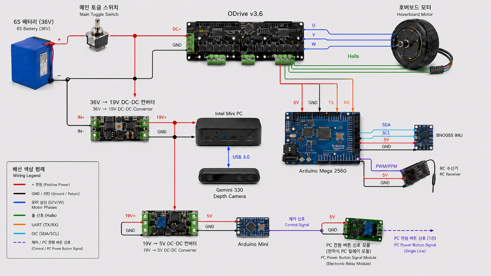

# Arduino-ROS Self-Balancing Robot

English | [한국어](README.ko.md)

This repository is my self-balancing robot project. The real robot was controlled on Arduino, and I used ROS/Gazebo for simulation, tuning, SLAM, and navigation experiments.

This is a portfolio reconstruction of the project rather than a perfectly chronological original development repository. I recovered and organized the final Arduino firmware, ROS/Gazebo workspace, hardware notes, media, CAD-related assets, results, and limitations so the project can be reviewed from evidence instead of scattered raw files.

The main result is a physical two-wheeled robot that balanced for about 1 hour and drove through a 10 m hallway and obstacle course under Arduino control. On the ROS side, I built Gazebo control, navigation, SLAM map-generation, PID tuning, and Arduino-to-ROS bridge workflows. The sim-to-real bridge is documented as a command-layer transfer: high-level motion intent is separated from the balance and safety layer instead of driving the robot directly.

## Interview Quick Read

- One-line summary: this is a two-wheeled self-balancing robot project where I isolated real hardware instability into sensor, communication, control-loop, and safety-logic problems, then stabilized the system step by step.
- My role: Arduino firmware, control algorithm design, IMU/encoder/ODrive/RC receiver integration, ROS/Gazebo simulation, SLAM/navigation workflows, and hardware debugging.
- Key debugging story: I moved away from IMU-integration-based speed estimation after finding tilt contamination, switched to wheel-encoder feedback, and added filtering/deadband/engage persistence for noisy RC PWM input. I also added current clamps and tilt cutoff so abnormal states would not become unsafe motor commands.
- Verification style: I split the system into small test paths such as `receiver_pwm_test`, `hall_sensor_test`, `odrive_receiver_test`, and `motor_current_test`, then integrated them back into the full robot.
- What to notice: the value of this project is not only the final demo, but the way unstable real hardware was made testable, safer, and repeatable.

<p align="center">
  
</p>

## Result Snapshot

| Area | Result |
| --- | --- |
| Physical balance duration | About 1 hour standing balance |
| Physical driving | 10 m hallway driving and obstacle-course driving |
| Physical safety limit | Motor command cutoff at `30 deg`, chosen because the protection bracket touches the floor at about `28 deg` |
| ODrive current limit | `+/-8 A` command clamp in firmware |
| RC signal handling | `+/-50 us` deadband, throttle/steering filter alpha `0.4`, engage filter alpha `0.02` |
| Arduino-to-ROS bridge | `/imu`, `/odom`, and `cmd_vel` checked with `rostopic echo` |
| ROS/Gazebo navigation | Robot motion through the ROS navigation command path was checked and captured in the depth-navigation simulation |
| ROS/Gazebo SLAM | Map generation was checked in the SLAM workflow |

## Core Result

<p align="center">
  
</p>

The Arduino closes the balance loop locally. RC intent, IMU tilt and yaw feedback, wheel-speed feedback, safety checks, and ODrive current commands are all combined into one real-time control path.

| Control layer | What it does |
| --- | --- |
| Balance | Body angle and angular velocity generate the main stabilizing current term. |
| Motion | RC throttle becomes a target speed, then shifts the balance point so the robot can drive while staying upright. |
| Safety | PWM filtering, engage persistence, tilt cutoff, and current limiting prevent bad states from reaching the motors. |

Start here: [physical balance control algorithm](firmware/physical_balance_controller/control_algorithm.md) and [troubleshooting summary](docs/troubleshooting.md).

## Project Scope

| Area | Status | Where to look |
| --- | --- | --- |
| Physical self-balancing and RC driving | Completed | [physical_balance_controller.ino](firmware/physical_balance_controller/physical_balance_controller.ino), [hallway demo](media/hero/physical_balance_hallway.gif) |
| ROS/Gazebo balance simulation | Completed | [balance_robot_control](ros_ws/src/balance_robot_control), [balance_robot_gazebo](ros_ws/src/balance_robot_gazebo) |
| Simulation navigation pipeline | Completed | [navigation](ros_ws/src/navigation), [balance_robot_workflows](ros_ws/src/balance_robot_workflows), [depth-navigation capture](media/process/simulation_depth_navigation_views.png) |
| Simulation SLAM/navigation workflow | Completed in simulation | [balance_robot_workflows](ros_ws/src/balance_robot_workflows), [results and limitations](docs/results-and-limitations.md) |
| Sim2Real bridge | Documented | [sim-to-real bridge](docs/sim2real.md), [results and limitations](docs/results-and-limitations.md) |
| Arduino-to-ROS bridge tests | Completed | [rc_to_ros_cmd_vel_bridge.ino](firmware/testers/rc_to_ros_cmd_vel_bridge.ino), [physical_balance_controller_ros.ino](firmware/physical_balance_controller_ros/physical_balance_controller_ros.ino) |
| Real-world ROS SLAM/navigation | Integration experiments | [real-world integration archive](archive/ros_experiments/real_world_integration), [results and limitations](docs/results-and-limitations.md) |

## Sim2Real Bridge

<p align="center">
  
</p>

<p align="center">
  
</p>

<p align="center">
  Full clip: <a href="media/process/simulation_depth_navigation_demo.webm">WebM download</a>
</p>

The simulation used the same two-wheeled, 3D-printed design direction as the physical robot, but the key transfer was the command structure. A high-level command is treated as motion intent first; the balance and safety layer decides what can safely reach the robot.

| Transfer point | Simulation side | Physical side |
| --- | --- | --- |
| Command path | `move_base -> /before_vel -> balance_robot_control -> /cmd_vel` | RC or ROS-side intent -> Arduino balance/safety loop -> ODrive current commands |
| Robot state | Gazebo `/imu`, `/odom`, scan/depth data, RViz map/navigation state | BNO055 IMU, ODrive feedback, RC PWM, Gemini 330 integration traces |
| What was proven | Navigation command routing, depth-navigation workflow, SLAM/map-generation workflow | Real balancing, RC driving, current limiting, tilt cutoff, and staged safety tuning |

This is why I describe the project as a sim-to-real bridge, not as finished physical autonomous navigation. The bridge is the transfer of robot design, command layering, and safety boundaries from simulation work into the real Arduino-controlled robot. See [docs/sim2real.md](docs/sim2real.md) for the detailed breakdown.

## System At A Glance

<table>
  <tr>
    <td width="50%">
      
    </td>
    <td width="50%">
      
    </td>
  </tr>
  <tr>
    <td valign="top">
      <strong>Control responsibility</strong><br>
      Arduino owns the real-time balance loop. ROS-side commands are treated as higher-level inputs, not direct motor authority.
    </td>
    <td valign="top">
      <strong>Hardware wiring</strong><br>
      36V power, ODrive, Arduino, BNO055, FrSky receiver, onboard PC, Gemini 330 camera, auxiliary electronics, and motors are summarized in one view.
    </td>
  </tr>
</table>

Main physical hardware: Arduino Mega 2560, BNO055 IMU, ODrive 3.6, FrSky Taranis Q X7 + X8R, Orbbec Gemini 330, dual hall-sensor BLDC hub motors, 36V battery, onboard mini PC, DC-DC converters, auxiliary Arduino, and relay module.

For the consolidated hardware explanation, see [docs/hardware.md](docs/hardware.md). For the build story and research context, see [docs/development-process.md](docs/development-process.md).

## Repository Layout

| Path | Purpose |
| --- | --- |
| `firmware/` | Arduino firmware, physical controller, and tester sketches |
| `ros_ws/` | Main ROS workspace for simulation, navigation, SLAM workflow, tuning code, and recovered actual-robot STL visuals |
| `mechanical/` | GitHub-ready 3D print, CAD, and sensor-head frame files copied from the original modeling archive |
| `docs/` | Focused portfolio docs: hardware, development process, Sim2Real, troubleshooting, and results |
| `media/` | Lightweight public GIFs, photos, and diagrams |
| `archive/` | Older experiments and recovered context that should not be the first place to read |

## Why The Title Includes Arduino And ROS

I kept `Arduino-ROS` in the title because the project really used both sides. Arduino handled the physical robot and some ROS publishing tests, while ROS/Gazebo handled simulation, visualization, SLAM and navigation workflows, and integration experiments.

| Sketch | ROS role | Published data |
| --- | --- | --- |
| [physical_balance_controller_ros.ino](firmware/physical_balance_controller_ros/physical_balance_controller_ros.ino) | ROS-enabled physical controller variant | `/imu`, `/odom` |
| [rc_to_ros_cmd_vel_bridge.ino](firmware/testers/rc_to_ros_cmd_vel_bridge.ino) | RC receiver to ROS command bridge | `cmd_vel` |
| [experimental_balance_controller_imu_ros.ino](archive/arduino_firmware/experimental_balance_controller_imu_ros.ino) | Archived IMU publisher experiment | `/imu` |
| [legacy_balance_controller.ino](archive/arduino_firmware/legacy_balance_controller.ino) | Archived ROS publisher trace | `/imu`, `/odom` publisher logic |

## ROS Workspace

This repository keeps the custom ROS packages, but it does not vendor every third-party dependency snapshot. Extra packages such as `rtabmap_ros`, `OrbbecSDK_ROS1`, `depthimage_to_laserscan`, `rosserial`, and TurtleBot3/Realsense simulation assets should be placed under `ros_ws/src/third_party/` when reproducing historical workflows.

```bash
cd ros_ws
catkin_make
source devel/setup.bash
roslaunch robot_bringup robot_remote_lidar.launch
```

Navigation-oriented simulation workflow:

```bash
roslaunch balance_robot_workflows robot_navigation_lidar.launch
```

Use [ros_ws/README.md](ros_ws/README.md) for workspace usage and [balance_robot_control/README.md](ros_ws/src/balance_robot_control/README.md) for the controller package layout.
The recovered body STL assets from the actual robot-based simulation baseline now live under [ros_ws/src/balance_robot_description/stl](ros_ws/src/balance_robot_description/stl), with notes in [docs/simulation-assets.md](docs/simulation-assets.md). The fabrication-oriented CAD and 3D-print files are organized separately in [mechanical](mechanical).

## Demo Media

- [Physical hallway balancing GIF](media/hero/physical_balance_hallway.gif)
- [Physical obstacle-course balancing GIF](media/demos/physical_balance_obstacle_course.gif)
- [ROS/Gazebo depth-navigation still](media/process/simulation_depth_navigation_views.png)
- [ROS/Gazebo depth-navigation GIF preview](media/process/simulation_depth_navigation_demo.gif)
- [ROS/Gazebo depth-navigation WebM clip](media/process/simulation_depth_navigation_demo.webm)
- [Robot-focused hallway still](media/demos/hallway_robot_only.jpg)
- [Open-front hardware photo](media/hardware/robot_open_front.png)

I did not put the full original phone MP4 files in the repo. Instead, I kept lightweight GIFs, still images, and one compact WebM simulation clip so the repository stays easier to browse. The navigation demo now includes a GitHub-friendly GIF preview plus the original WebM clip for higher-quality playback.

## Read Next

1. [Physical controller](firmware/physical_balance_controller/README.md): main Arduino firmware for the real balancing robot.
2. [Control algorithm](firmware/physical_balance_controller/control_algorithm.md): how RC input, IMU feedback, wheel speed, safety, and ODrive current control fit together.
3. [Hardware](docs/hardware.md): physical components, wiring, power flow, and layout interpretation.
4. [Mechanical 3D files](mechanical): printable frame parts, editable CAD exports, and sensor-head structure files.
5. [Development process](docs/development-process.md): build timeline, subsystem bring-up, and research decisions.
6. [Sim2Real bridge](docs/sim2real.md): how the ROS/Gazebo workflow and physical Arduino robot were connected without overstating physical autonomy.
7. [Troubleshooting summary](docs/troubleshooting.md): why filtering, safety gating, ODrive isolation, and staged tuning were needed.
8. [Results and limits](docs/results-and-limitations.md): measured project results, code-defined settings, and remaining limits.

## Limitations

- This repository is organized for portfolio review, so the commit history is not a complete record of every original hardware experiment.
- Full end-to-end autonomous ROS navigation on the physical balancing robot remains future work.
- Some older code remains in `archive/` because it still helps explain how the project evolved.
- Third-party ROS dependencies are not vendored into this repository.
- Raw process files, chat exports, and full-length videos were summarized or replaced with lighter public assets.
- Code is MIT-licensed. Media, photos, demo captures, CAD files, and 3D-print assets are included for portfolio documentation; see [LICENSE](LICENSE).
