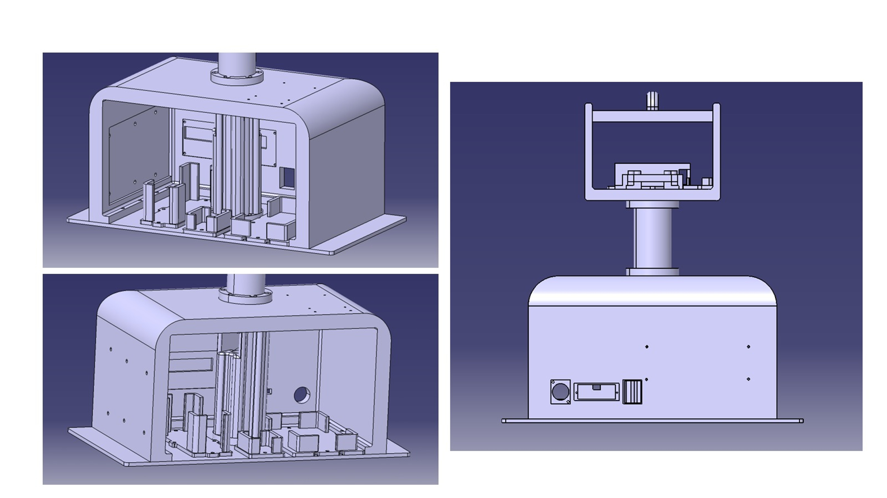
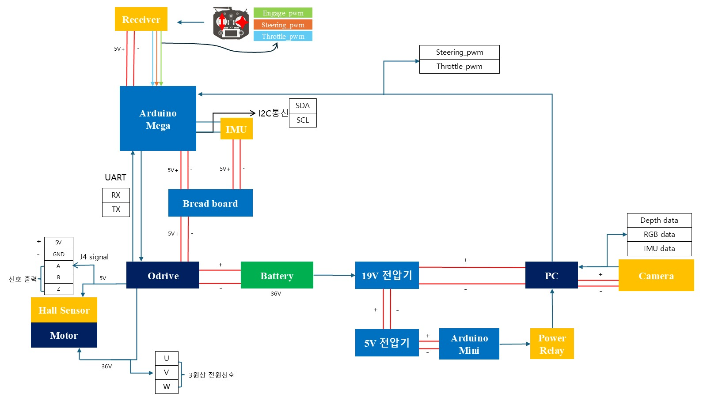
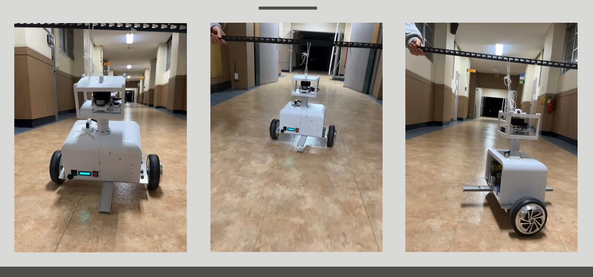
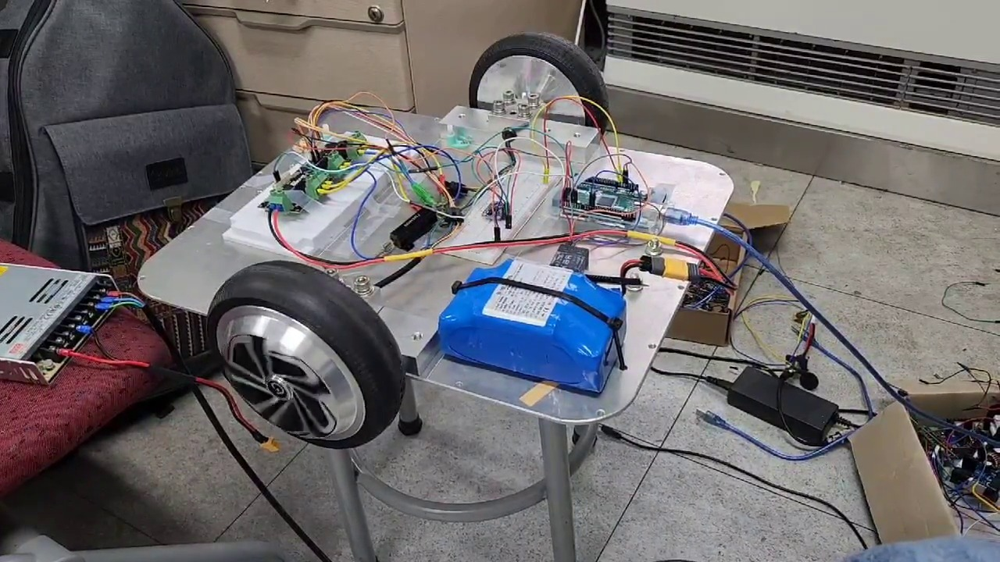
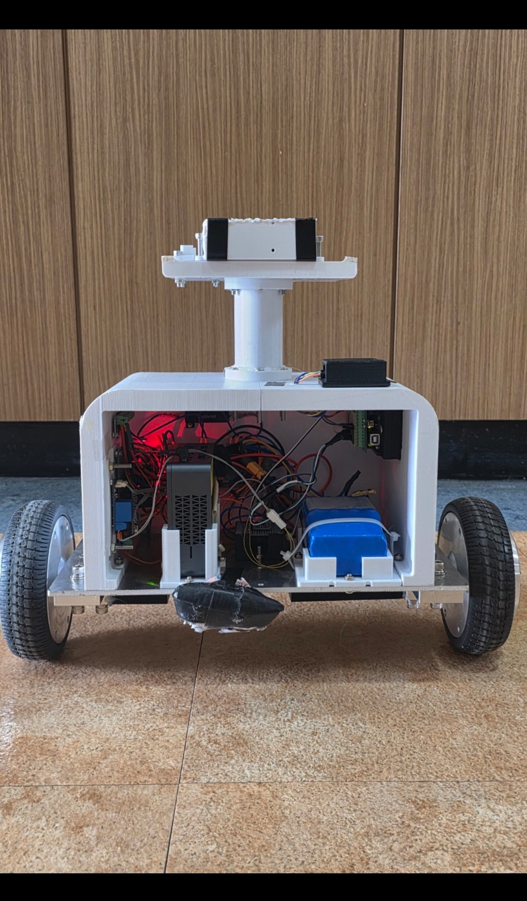
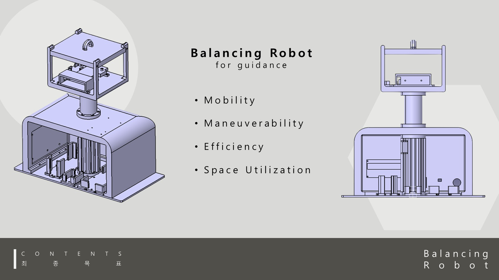
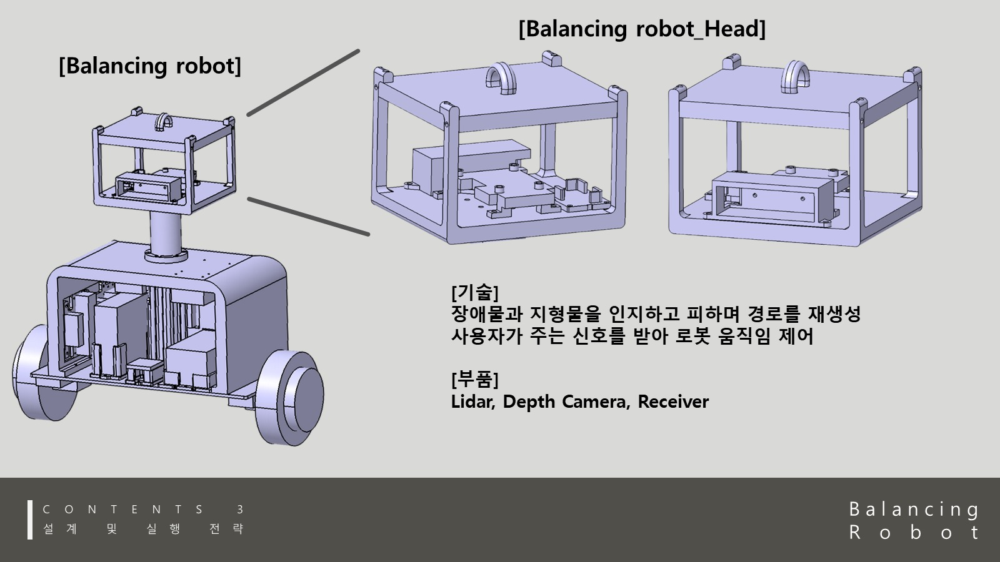
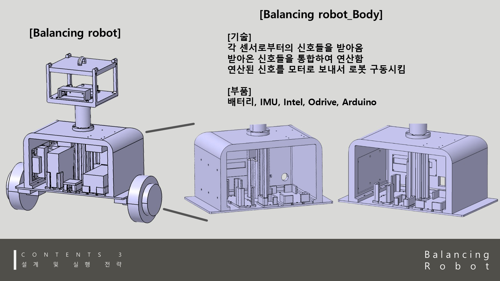
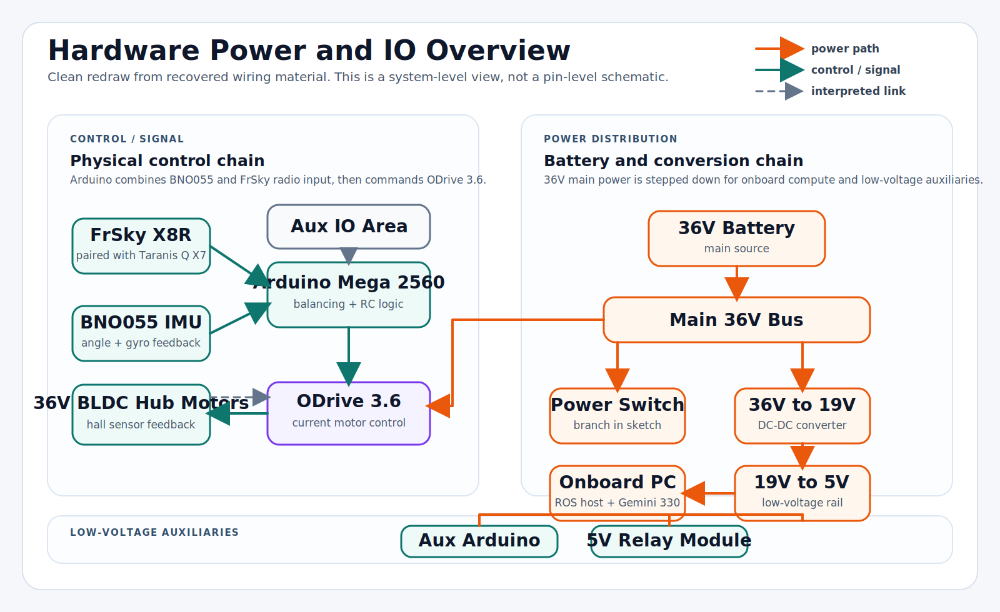

# Build Story

## What This Page Explains

This page brings the project together as one build story: how the balancing robot moved from an idea, to CAD design, to wiring, to wheel tests, to real balancing practice, and finally to the curated Arduino and ROS evidence in this repository.

It is intentionally evidence-first. Images show the process; text explains what each stage proved.

## Process At A Glance

| Mechanical concept | Wiring architecture | Real-world bring-up |
| --- | --- | --- |
|  |  |  |

| Bench testing | Simulation navigation | Final internal hardware |
| --- | --- | --- |
|  |  |  |

## 1. Define The Robot Goal

The project started from a guide-robot idea: a compact two-wheeled platform that could move through a space, balance itself, and eventually connect to navigation or perception workflows.

<p align="center">
  
</p>

The important early decision was to treat the robot as two related systems:

- Physical balance robot: Arduino, BNO055, ODrive, RC receiver, wheel motors, and real tuning.
- ROS simulation/integration stack: Gazebo balancing model, SLAM/navigation launches, and command-pipeline experiments.

That split is why this repository separates completed physical balancing from simulation-side navigation and partial physical ROS integration.

## 2. Design The Mechanical Package

The robot needed enough room for batteries, power conversion, the motor controller, low-level electronics, onboard compute, and a raised sensor head. The CATIA views show that the chassis and head were designed around those packaging constraints rather than assembled as loose parts.

| Upper head structure | Main body structure |
| --- | --- |
|  |  |

This stage answered practical questions:

- Where does the camera or depth sensor sit?
- Where can the battery and compute unit fit?
- How can the front stay open enough for wiring and debugging?
- How does the two-wheel base support the upper mast?

## 3. Plan Power And Signal Flow

The wiring work connected the physical control path and the higher-level compute path. The recovered block diagram shows the intended relationship among the receiver, Arduino Mega, IMU, ODrive, motors, battery, converters, onboard PC, camera, mini Arduino, and relay module.

<p align="center">
  
</p>

The public diagram below is the cleaned documentation version of that recovered source material.

<p align="center">
  
</p>

Key architecture choices:

- The Arduino Mega handled real-time balancing and RC input.
- The BNO055 IMU provided body angle and gyro feedback.
- The ODrive 3.6 drove the wheel motors using current commands.
- The battery and converters formed a 36V main bus, a 19V compute rail, and a 5V auxiliary/control rail.
- The onboard PC and camera/depth sensor belonged to the higher-level perception and ROS integration path.

## 4. Bring Up Motors Before Balancing

The project did not jump straight into full-body balancing. The wheel, power, motor controller, and electronics were tested in an open bench setup first.

<p align="center">
  
</p>

This stage was used to reduce uncertainty around:

- ODrive setup and motor communication.
- Motor phase and hall-sensor wiring.
- Battery and power distribution behavior.
- Arduino-to-ODrive command path.
- Whether wheel feedback could be trusted before putting the robot upright.

This is also where the project began moving from simple motor movement toward the feedback needed for balancing.

## 5. Build The Embedded Balance Controller

The main physical controller became [`physical_balance_controller.ino`](../firmware/physical_balance_controller/physical_balance_controller.ino). It kept the critical loop on Arduino instead of depending on ROS for real-time balance control.

The controller combined:

- RC PWM input for throttle, steering, and engage behavior.
- BNO055 Euler angle and gyro readings.
- ODrive encoder speed reads and current command output.
- Filtering and thresholds around noisy input values.
- Safety behavior for tilt and motor engagement.
- Parameter tuning for balance, speed, and steering.

The key idea was simple but hard in practice: read the robot's body angle and wheel behavior, calculate the correction, then send current commands to both motors fast enough and consistently enough to keep the body upright.

## 6. Tune With A Safety Line

Once the robot could be assembled as a full body, the next step was physical practice with a tether. This made it possible to adjust parameters without treating every fall as a destructive test.

<p align="center">
  
</p>

This stage tested the real interaction among:

- IMU angle and gyro feedback.
- Wheel speed feedback.
- ODrive current response.
- RC throttle and steering input.
- Physical weight distribution.
- Chassis stiffness and wiring reliability.

The final public demos come after this kind of staged tuning, not from a single instant success.

## 7. Build A Parallel ROS/Gazebo Track

ROS and Gazebo were used to explore simulation-side balancing, SLAM, and navigation workflows without risking the physical robot at every iteration.

<p align="center">
  
</p>

The most important software architecture choice was separating navigation commands from final balance commands:

```text
teleop or move_base
  -> /before_vel
  -> balance controller
  -> /cmd_vel
  -> Gazebo robot
```

That separation matches the nature of a balancing robot: high-level navigation cannot simply command wheel velocity without a balance controller mediating the motion.

## 8. Validate What Was Actually Completed

The final repository is deliberately conservative. It highlights the strongest verified outcomes while keeping research and partial integration work in the right category.

| Area | Final status | Evidence |
| --- | --- | --- |
| Physical self-balancing | Completed | Arduino controller and physical demo GIF |
| RC driving while balancing | Completed | Physical demo media and RC input firmware |
| ODrive / motor / IMU / RC bring-up | Completed | Firmware, process images, and hardware docs |
| ROS/Gazebo balancing simulation | Completed | `ros_ws/src/robot_controll` and Gazebo launch files |
| Simulation SLAM/navigation | Completed as simulation workflow | `robot_ability`, `navigation`, maps, launches, and screenshots |
| Physical autonomous ROS navigation | Partial | Launch/integration evidence exists, but no end-to-end physical autonomous claim |

## What The Build Process Shows

This project is strongest when read as a full-stack robotics build:

- Mechanical design was used to package real electronics, not just to render a concept.
- Hardware was brought up gradually: power, motors, sensors, controller, then full-body balance.
- Embedded control stayed close to the hardware where timing mattered.
- ROS/Gazebo was used for simulation and navigation architecture without overstating the physical robot's autonomous capability.
- The final GitHub structure separates completed results, process evidence, research decisions, and legacy material.

For detailed supporting pages, see:

- [Development process](development_process.md)
- [Hardware overview](hardware.md)
- [Software architecture](software_architecture.md)
- [Experiments](experiments.md)
- [Results and limitations](results_and_limitations.md)
