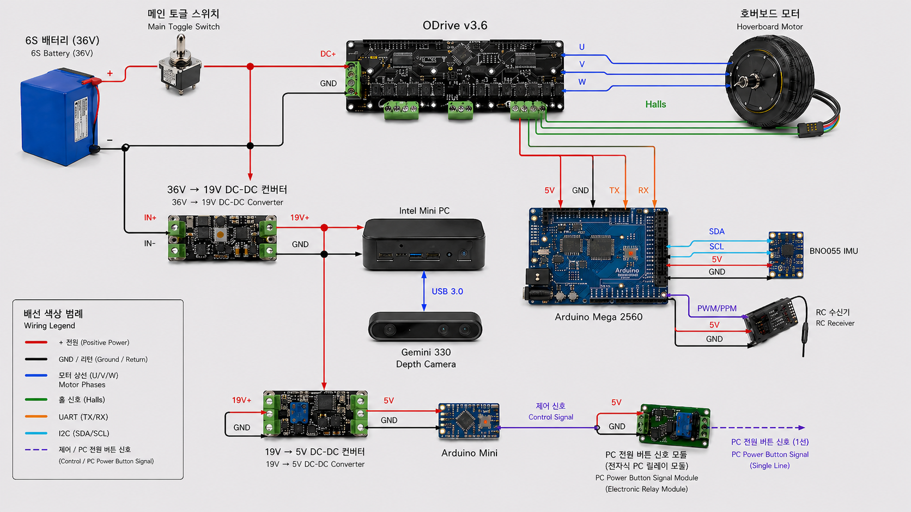
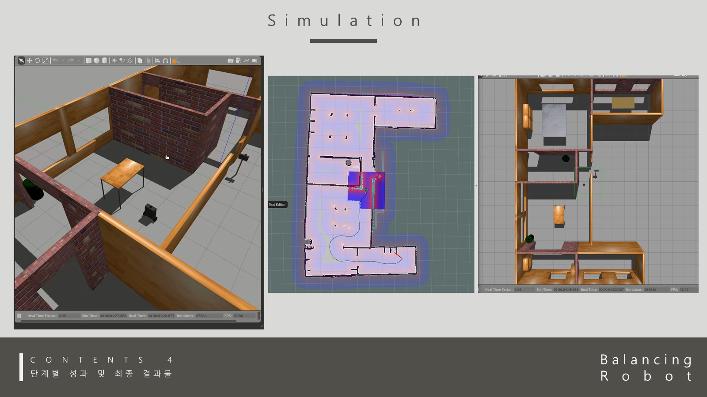

# Development Process

## Purpose

This page summarizes the recovered build-process material as visual evidence instead of publishing raw presentation decks, private chat logs, or large source files.

The goal is to show how the robot progressed from concept, CAD assembly, wiring, bench tests, tethered driving practice, and simulation into the verified portfolio claims.

## Visual Build Evidence

### 1. Concept And Mechanical Assembly

The recovered CATIA material shows the intended physical form: a compact two-wheeled balancing robot with an upper sensor head and an internal electronics bay.

The CATIA assembly views make the hardware story easier to inspect than text alone. They show the body volume, internal packaging direction, upper mast, and rear/front layout before the physical wiring was finalized.

### 2. Head, Body, And Packaging Iteration

| Head design | Body design |
| --- | --- |
|  |  |

These slides show that the robot was not only a software demo. The physical chassis, head enclosure, sensor placement, battery/compute space, and service opening were considered as part of the build.

### 3. Wiring And Control Architecture

The Wiring Diagram connects the FrSky Taranis Q X7 / X8R radio path, Arduino Mega 2560, BNO055 IMU, ODrive 3.6, battery, voltage converters, onboard PC, Orbbec Gemini 330, auxiliary Arduino, and relay module. It is the repository's current public system-level summary of the robot wiring and control architecture.

### 4. Wheel And Motor Bench Testing

Before the completed robot demos, the wheel/motor/control electronics were tested on an open bench. This stage was important for checking ODrive bring-up, hall-sensor feedback, power wiring, and controller communication before balancing the full body.

### 5. Tethered Driving Practice

The tethered driving photos show the practical safety step between bench testing and free driving. The robot was practiced with an overhead support line while balance and drive parameters were adjusted.

### 6. Simulation And Navigation Evidence

The simulation screenshots show the parallel ROS/Gazebo track: simulated robot placement, map/navigation views, and environment testing. This supports the repository's separation between completed simulation navigation and partial physical autonomous navigation.

## Build Timeline

| Phase | Focus | Public interpretation | Outcome |
| --- | --- | --- | --- |
| Concept definition | Two-wheeled guide robot with mobility, maneuverability, and efficient space use | Final presentation material framed the robot as a compact mobile guidance platform | Project goal narrowed to a balancing robot plus ROS navigation exploration |
| Subsystem planning | ODrive 3.6, Arduino Mega 2560, BNO055 IMU, FrSky Taranis Q X7 + X8R, Orbbec Gemini 330, and power conversion | Research notes and weekly reports separated hardware control from ROS navigation work | Main workstreams became physical balance control and ROS/Gazebo simulation |
| ODrive and motor bring-up | Ubuntu setup, ODrive tooling, voltage checks, firmware setup, motor and hall-sensor connection | Weekly report material records staged motor-controller bring-up before full robot integration | Motor control path was validated before balancing experiments |
| Control integration | Arduino Mega 2560, BNO055 IMU, FrSky X8R receiver, and ODrive command path | Firmware and process notes show IMU feedback, RC input, and motor command integration | Physical balancing and RC driving became the strongest real-world result |
| Hardware assembly | Internal placement, wiring, battery pack, converter chain, relay/auxiliary area | Recovered wiring notes and internal photo were converted into public diagrams and photos | Public hardware evidence now uses raw photos plus the Wiring Diagram |
| ROS simulation and navigation | Gazebo balancing robot, `/before_vel`, SLAM/navigation launch composition | ROS packages show simulation control, mapping/navigation experiments, and launch integration | Simulation navigation is documented as completed; physical autonomous navigation is not claimed |
| Portfolio recovery | Curated demos, firmware, ROS packages, legacy notes, and public-safe media | Raw project material was summarized instead of copied wholesale | Repository now separates final evidence from legacy and research material |

## Functional Workstreams

| Workstream | What it covered | Public evidence |
| --- | --- | --- |
| ODrive / motor | Motor controller setup, hall-sensor feedback, motor synchronization, current control experiments | `firmware/physical_balance_controller`, `firmware/testers/motor_current_test`, `firmware/testers/odrive_receiver_test`, `archive/legacy_firmware`, hardware photos |
| FrSky radio path | X8R PWM input, Taranis Q X7 manual commands, and engage/throttle/steering interpretation | `physical_balance_controller.ino`, `receiver_pwm_test.ino`, `rc_to_ros_cmd_vel_bridge.ino`, receiver troubleshooting notes |
| IMU / balancing | BNO055 angle and gyro feedback, balance-loop tuning, safety-constrained parameter testing | `physical_balance_controller.ino`, hallway and obstacle-course demos |
| ROS / navigation | Gazebo balancing simulation, `/before_vel` command separation, SLAM/navigation launch files | `ros_ws/src/balance_robot_control`, `ros_ws/src/navigation`, `ros_ws/src/balance_robot_workflows` |
| Hardware assembly | Chassis packaging, internal electronics bay, battery and DC-DC power chain | `media/hardware`, `media/diagrams/wiring_diagram.png` |
| Research and documentation | CAN, Orbbec Gemini 330, ORB-SLAM2, RTAB-Map, FrSky receiver noise, and ROS autorun investigation | `docs/research_and_design_decisions.md` |

## Component Bring-Up Process

The recovered process material shows that each major part was brought up separately before being treated as part of the full robot. This is the most important engineering story behind the final demos: the robot became stable only after the team reduced each component to a testable role.

| Component | Bring-up goal | Trial-and-error process | Stabilized use in the project |
| --- | --- | --- | --- |
| ODrive 3.6 | Drive both wheel motors reliably before balancing | Set up Ubuntu/ODrive tooling, checked input voltage, connected motor phases and hall sensors, tested controller modes, then moved from simple spin tests toward current commands; the repository now keeps a focused motor-current test sketch for that bring-up path | Used as the current-control motor driver commanded by Arduino firmware |
| Wheel motors + hall sensors | Read wheel motion well enough for balancing and drive correction | Compared motor speed feedback, filtered abnormal readings, counted hall-state transitions, and tuned speed-related feedback so the two wheels could respond together | Used for wheel speed feedback and motor synchronization during physical balance control |
| BNO055 IMU | Provide body angle and gyro feedback for the balance loop | Verified sensor startup, handled calibration data, stored offsets in EEPROM, and used angle/gyro readings as the core balancing signal | Used as the main physical attitude sensor in `physical_balance_controller.ino` |
| FrSky X8R + Taranis Q X7 | Convert manual remote input into safe steering, throttle, and engage commands | Measured PWM pulse width with interrupts, filtered noisy channel values, added thresholds around neutral, and used engage persistence to avoid accidental motor activation | Used for manual driving while balancing and for RC-to-ROS bridge testing |
| Arduino Mega 2560 | Keep the low-level balance loop deterministic and independent from ROS | Integrated PWM input, IMU readings, ODrive serial communication, safety checks, and current-command output in one firmware loop | Became the main physical controller for the completed real robot behavior |
| Power chain | Feed motor power, onboard compute, and low-voltage auxiliaries from one robot package | Recovered wiring notes show a 36V main bus, a 36V to 19V conversion stage, and a 19V to 5V stage for lower-voltage electronics | Documented through the clean power/IO diagram and internal hardware photo |
| Orbbec Gemini 330 | Explore perception hardware for SLAM/navigation | Compared depth-camera capability and SLAM approaches before the physical autonomous navigation path was fully completed | Kept as deployed sensor-head evidence and research context, not as a completed physical navigation claim |
| ROS/Gazebo stack | Test balancing/navigation ideas without risking hardware | Built simulation launch files, separated navigation command input through `/before_vel`, and tuned control behavior in Gazebo | Used as the completed simulation and navigation evidence track |

## Trial-And-Error Highlights

| Challenge | Iteration path | Lesson captured in the repository |
| --- | --- | --- |
| Real balancing was sensitive to small tuning changes | Started with subsystem checks, then combined IMU angle, gyro rate, wheel speed feedback, and ODrive current commands under safety limits | Physical balancing should be judged through the final controller and curated demos, not by raw notes alone |
| RC input could jump or drift around neutral | PWM values were filtered, neutral thresholds were added, and engage logic required persistence before motor activation | Manual control was treated as a signal-processing problem, not just a wiring task |
| Motor feedback could produce unstable behavior if trusted blindly | Encoder speed history and filtering were used to reduce the effect of abnormal readings | Feedback quality mattered as much as the controller equation |
| IMU calibration affected repeatability | BNO055 calibration offsets were saved and loaded, and calibration status was exposed through serial output | Sensor calibration became part of the operating process |
| Hardware packaging created interpretation risk | Internal photos showed the real layout, but exact labels could be misleading if drawn directly on the image | Public docs now use raw photos plus a clean diagram instead of uncertain photo annotations |
| SLAM/navigation ambition exceeded verified physical evidence | Visual/depth SLAM and RTAB-Map/ORB-SLAM2 were researched while simulation navigation matured | The repository separates completed simulation work from partial physical integration |

## Problems And Resolutions

| Problem | What was learned | Portfolio-safe result |
| --- | --- | --- |
| Balance tuning on the real robot was sensitive to hall-sensor and IMU feedback | Physical testing needed staged safety setup and iterative parameter adjustment | Real balancing is shown through curated physical demo media and firmware |
| FrSky receiver signals were vulnerable to wiring length and noise concerns | Shorter wiring, better connections, shielding/twisted signal-ground routing, and filtering were identified as mitigations | Troubleshooting is documented as engineering process, not as a final wiring guarantee |
| Depth-camera and SLAM options had integration uncertainty | Orbbec Gemini 330, ORB-SLAM2, and RTAB-Map were compared before final physical navigation was complete | Simulation and integration experiments are documented separately from completed physical balancing |
| Raw project files mixed useful evidence with private or noisy material | Public docs summarize the technical process and omit chat logs and raw decks | GitHub remains reviewer-friendly and avoids publishing unnecessary personal material |

## Final Public Claims

- Real robot balancing and RC driving were completed and are backed by firmware plus curated demo media.
- ROS/Gazebo balancing, SLAM-related launch composition, and simulation navigation were completed as software-side work.
- Real-world ROS SLAM/navigation integration existed as experiments, but full autonomous navigation on the physical robot is not claimed.
- Raw process artifacts are treated as source material for these summaries, not as primary public deliverables.
