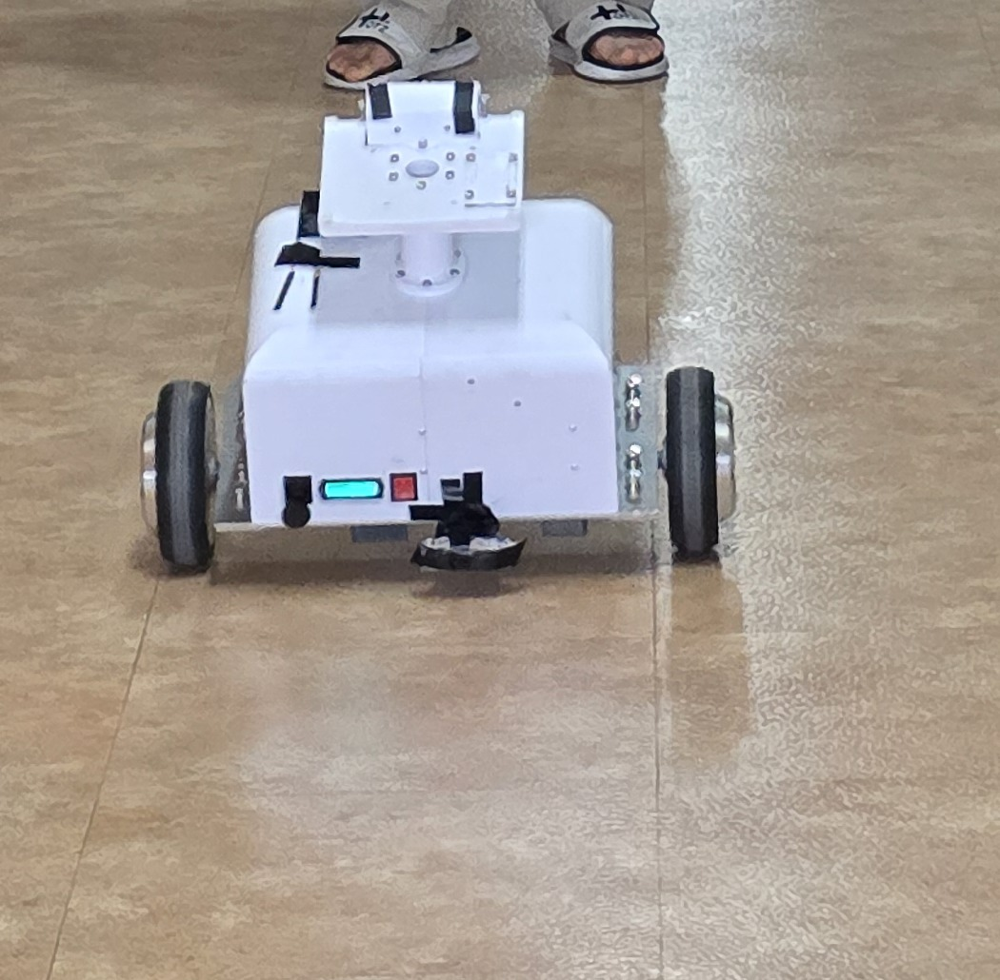

# Hardware Gallery

## Wiring Diagram

Caption: Current public system-level wiring summary, keeping the FrSky radio path, Arduino Mega 2560, BNO055, ODrive 3.6, battery, converters, onboard PC, auxiliary Arduino, relay-related blocks, and the Orbbec Gemini 330 relationship readable without inventing pin-level details.

## Internal Layout

Caption: Raw front-open view of the physical robot showing the electronics bay, battery pack, onboard compute enclosure, Orbbec Gemini 330 sensor head, and wheel base.

## Build Process Evidence

Caption: Open-bench wheel and electronics test used before full-body balancing practice.

Caption: Tethered driving practice used as a safety step while balance and drive parameters were tuned.

## Physical Driving Scene

Caption: Cropped physical driving still used as a robot-focused public image from the hallway test session.
