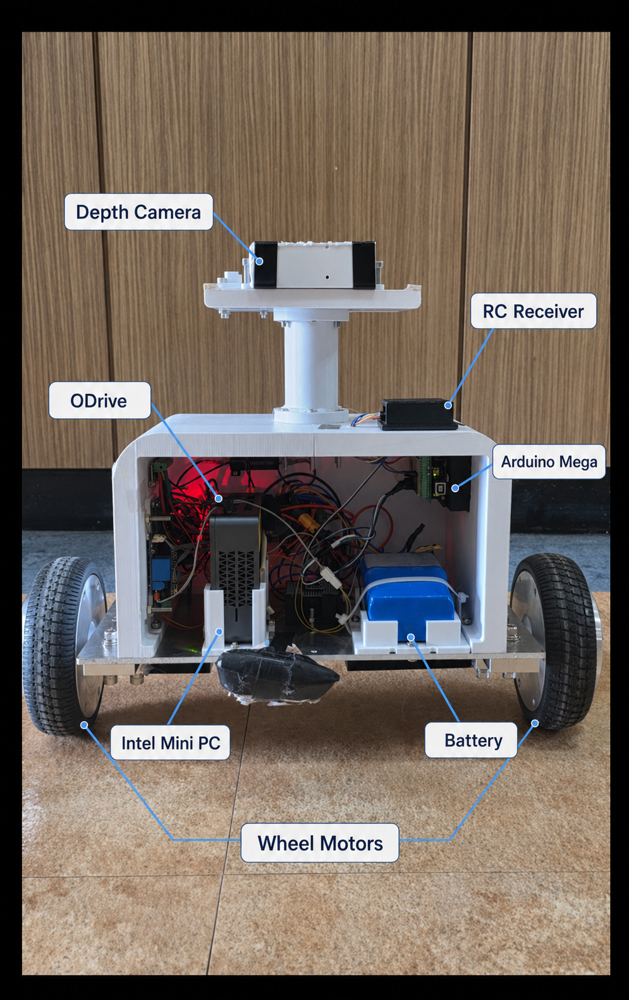

# Hardware Layout

## Primary Internal Photo

## Visible Zones

The repository now uses the raw internal photo as the main layout figure so the documentation does not over-claim exact component positions with misleading callouts.

Most reliable visual groupings:

- `Orbbec Gemini 330 sensor-head area`: upper mast-mounted module
- `Left auxiliary board area`: left-side board cluster inside the chassis opening
- `Central compute and wiring bay`: vented enclosure plus dense harness region in the middle
- `36V battery pack`: blue pack mounted on the right side
- `Front service opening`: open chassis face that exposes the internal electronics for inspection

## Why The Photo Is Left Raw

- The earlier annotated figure risked pointing at the wrong physical targets.
- The raw photo is a safer public source of truth for placement and packaging evidence.
- Interpreted relationships now live in the Wiring Diagram instead of being baked into the photo.
- Recovered process material confirms that internal placement and wiring layout were part of the build process, but the public repository keeps those interpretations in Markdown and diagrams instead of labeling uncertain photo targets.

## Mechanical Layout Signals

From the image and recovered CAD/mesh archive, the physical design appears to use:

- a two-wheel base
- a rectangular main electronics chassis
- an open front service view for the electronics bay
- a raised neck or mast structure
- an upper sensor head platform

## Full Hardware Stack Reference

The full physical stack associated with this body layout was:

- FrSky 2.4GHz Taranis Q X7 transmitter
- FrSky X8R receiver
- Arduino Mega 2560
- BNO055 IMU
- ODrive 3.6
- dual hall-sensor BLDC wheel motors
- 36V battery pack
- 36V -> 19V and 19V -> 5V converters
- onboard mini PC
- auxiliary Arduino Mini/Nano-class board
- relay module
- Orbbec Gemini 330 depth camera

## Supporting Diagram And Photo

Use these assets together when you need both physical placement and interpreted system relationships:

- [robot_open_front.png](../media/hardware/robot_open_front.png)
- [Wiring Diagram.png](<../media/process/Wiring Diagram.png>)
- [development_process.md](development_process.md)
