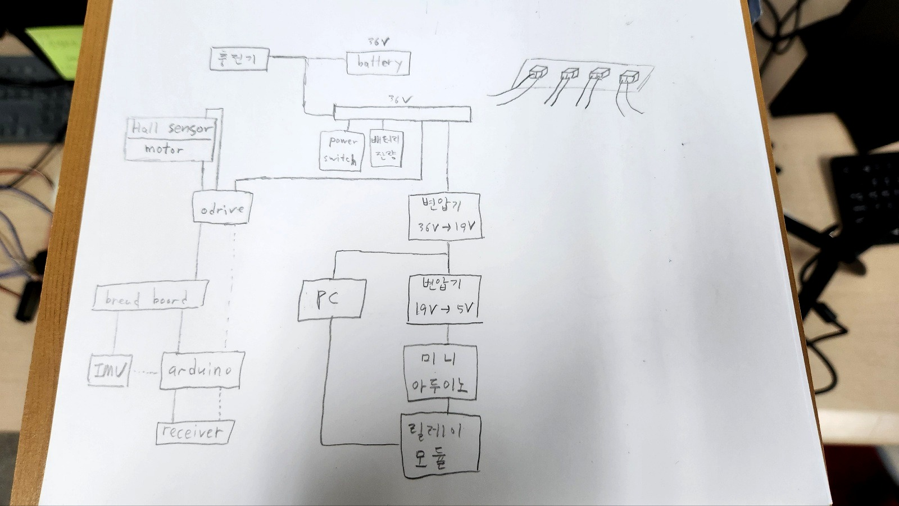

# Hardware Power And IO

## Clean Diagram


## Recovered Sketch Source



## Interpreted Power Flow

The clean diagram is the official public-facing version of the recovered wiring material. It was redrawn from the hand sketch and a recovered circuit-planning deck, but the raw deck is treated only as source material and is not published as a primary artifact.

Both the diagram and sketch are high-level system views rather than full electrical schematics.

Most defensible interpretation:

1. A `36V battery` feeds the main system bus.
2. The main bus goes to the motor-control side, including the `ODrive`.
3. A `36V -> 19V` converter powers the onboard `PC`.
4. A `19V -> 5V` converter powers smaller control electronics, including a `mini Arduino` and a `relay module`.

## Interpreted Signal Flow

On the left side of the sketch, the physical control chain appears as:

- hall-sensor motor -> ODrive
- ODrive -> auxiliary electronics or breadboard area
- IMU -> Arduino
- RC receiver -> Arduino

This matches the firmware architecture where Arduino runs the balancing loop while reading IMU and RC input, and then sends motor commands to ODrive.

## High-Level Architecture

```text
36V Battery
  -> Main bus
    -> ODrive -> wheel motors
    -> 36V->19V converter -> onboard PC
    -> 19V->5V converter -> mini Arduino / relay module

IMU -> Arduino
RC receiver -> Arduino
Arduino -> ODrive command path
```

## Evidence Limits

- The sketch is a planning artifact, not a manufacturing schematic.
- The recovered circuit deck was used to redraw the public diagram; it should not be treated as a standalone public schematic.
- Wire colors, connector pinouts, and exact regulator modules should not be inferred beyond what is directly visible.
- This document is intended to explain the project system story for a portfolio reviewer, not to serve as a build guide.
