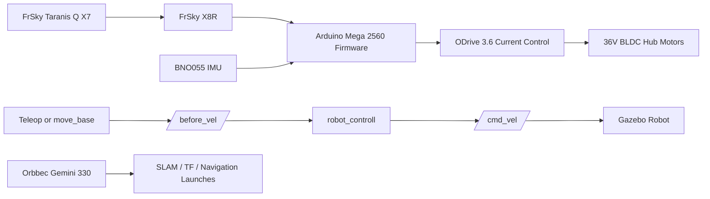

# Software Architecture

## Overview

The project evolved into three related software tracks:

1. Physical robot firmware on Arduino
2. ROS/Gazebo simulation for balancing, SLAM, and navigation
3. Real-world ROS integration experiments for camera/SLAM/navigation bring-up

## Architecture Summary

## Physical Robot Path

Representative code:

- [`physical_balance_controller.ino`](../firmware/physical_balance_controller/physical_balance_controller.ino)
- [`legacy_balance_controller.ino`](../archive/legacy_firmware/legacy_balance_controller.ino)
- [`experimental_balance_controller_imu_ros.ino`](../archive/legacy_firmware/experimental_balance_controller_imu_ros.ino)

Behavior:

- FrSky Taranis Q X7 sends manual commands to the FrSky X8R receiver.
- Arduino Mega 2560 reads RC PWM inputs from the FrSky X8R.
- BNO055 provides body angle and gyro information.
- ODrive 3.6 provides motor state and accepts current commands.
- The balancing and driving loop runs entirely on Arduino for the physical robot.

## Simulation Path

Representative packages:

- [`balance_robot_bringup`](../ros_ws/src/balance_robot_bringup)
- [`balance_robot_gazebo`](../ros_ws/src/balance_robot_gazebo)
- [`robot_controll`](../ros_ws/src/robot_controll)
- [`navigation`](../ros_ws/src/navigation)

Core idea:

`move_base` or teleop does not directly drive the balancing robot. Instead, it publishes a higher-level command to `/before_vel`, and the balancing controller converts that into the final `/cmd_vel` sent to the simulated robot.

This separation is one of the most important architectural choices in the project.

## Real-World ROS Integration Experiments

Representative archive files:

- [`robot_slam.launch`](../archive/legacy_code/real_world_integration/robot_slam.launch)
- [`robot_navigation_lidar.launch`](../archive/legacy_code/real_world_integration/robot_navigation_lidar.launch)
- [`move_base.launch`](../archive/legacy_code/real_world_integration/move_base.launch)

These files show that camera/SLAM/navigation integration work was performed, but this repository does not claim verified end-to-end autonomous navigation on the physical robot.

Some simulation-side depth files in the repository still use historical `d435` topic names or `realsense_ros_gazebo` assets. Those should be read as older simulation or placeholder RGB-D configurations, not as the deployed physical camera choice for the real robot.
