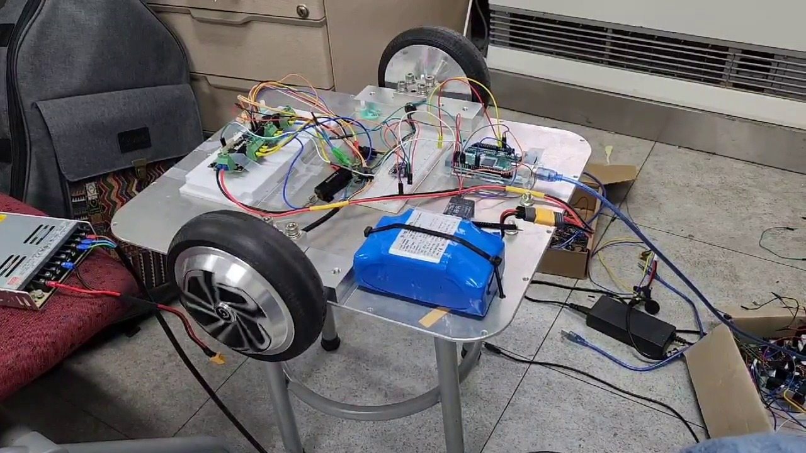
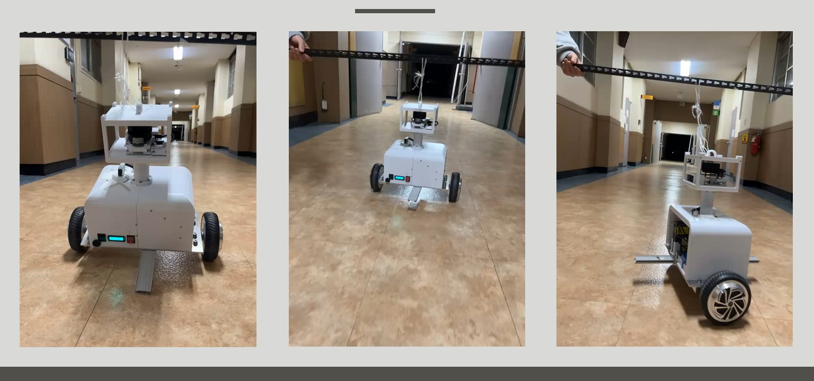

# From standing to driving: separate the test stages and control terms

[한국어](../../ko/troubleshooting/major/03-balance-tuning.md) | [All troubleshooting](../../troubleshooting.md)

> Wheel/motor bench checks and tethered physical tests preceded free driving. The final controller combines balance, speed, and steering correction. Photos establish the testing environment; code and demos establish implementation and final behavior.

## A fall did not identify a gain fault

Physical recovery depended on attitude reference, wheel feedback, motor response, mass distribution, and gains. Changing everything on the assembled robot made failure attribution difficult.

Standing still and remaining upright while driving/turning were also different requirements. Direct motion requests could conflict with the wheel effort needed for body recovery.

## The testing environment was staged



*Wheel/motor/control electronics checked separately from the assembled robot.*



*Support-line practice before free driving.*

These photos show subsystem checks and constrained full-body testing. They do not measure a particular gain's improvement, but they establish part of the physical testing process.

The documented progression includes component bring-up, tethered attitude/driving practice, and hallway/obstacle driving. A complete gain-change history is not retained; final settings should not be described as the values used at every stage.

## Balance, speed, and steering received different roles

The final code calculates three correction terms and mixes them into two motor-current requests:

```cpp
float balance_controller = K_theta/100 * theta - K_theta_dot/100 * theta_dot + Ki/100 * integral_error;

torque_input_0 = (balance_controller - speed_control - steering_controller);
torque_input_1 = (balance_controller - speed_control + steering_controller);
```

| Term | Information used | Problem addressed |
| --- | --- | --- |
| Balance | Body angle and angular rate | Body recovery and attitude changes |
| Speed | Target minus mean wheel speed | Difference between requested and actual motion |
| Steering | Steering input and yaw rate | Differential effort alongside common recovery effort |

Balance and speed terms enter both wheels in common; steering enters with opposite signs. This preserves a shared stabilizing component while adding turning effort.

Initial settings in the final sketch are balance `K_theta=24`, `K_theta_dot=1.7`, `Ki=0`, and speed `Kp=1.2`, `Ki=0.1`, `Kd=7`. The balance-integral path exists but contributes zero at this initial setting. Speed sums/differences are per update without explicit `dt` normalization; these numbers are not directly portable to a different controller timing model.

## Adjustable variables and output bounds were explicit

The serial interface separates attitude gains, upright reference, and speed gains:

| Key | Parameter | Investigation dimension |
| --- | --- | --- |
| `q` / `e` | `K_theta` / `K_theta_dot` | Recovery and angular-rate response |
| `r` | `imu_angle_offset` | Sensor reference versus physical upright |
| `a` / `s` / `d` | Speed P/I/D coefficients | Motion correction |

This is the implemented tuning interface, not a recovered chronological record of every key used.

Outgoing current requests are bounded to +/-8 A, speed correction to +/-6, and speed-integral state to +/-5. Body tilt beyond 30 degrees sets a flag used in motor-deactivation decisions.

The current implementation also leaves review points. Axis activation updates run at a 50 ms interval, while `ApplyMotorCommands()` itself has no activation-state condition. Excessive tilt returns early from balance calculation; output freshness and state-transition timing therefore need to be considered together. The code should not be described as an independent immediate current-transmission gate. Bracket contact is recorded near 28 degrees, so the 30-degree threshold also does not guarantee pre-contact protection.

## Final motion is visible; each change's contribution needs separate evidence


*The Arduino-controlled robot maintaining balance while moving.*

An [obstacle-course demo](../../../media/demos/physical_balance_obstacle_course.gif) is also available. The [result document](../../results-and-limitations.md) reports about one hour of balance and 10 m hallway driving. The GIF demonstrates motion; it is not a full-duration recording that independently measures the one-hour result.

The case connects **subsystem checks → constrained physical tests → combined control terms → final driving**. Attributing success to a single gain or quantifying a reduction in falls would require repeat-test data.

## Evidence a reviewer can inspect

**Work demonstrated:** staged physical testing, separation of control roles, tuning interface design, and connecting implementation with results.

- Bench/tether photos above: physical process evidence.
- [Controller](../../../firmware/physical_balance_controller/physical_balance_controller.ino): terms, mixing, tuning functions, and bounds.
- [Control algorithm](../../../firmware/physical_balance_controller/control_algorithm.md): overall signal/control flow.
- [Hallway](../../../media/hero/physical_balance_hallway.gif) / [obstacle demo](../../../media/demos/physical_balance_obstacle_course.gif): final behavior.
- [Results and limitations](../../results-and-limitations.md): reported duration and driving scope.

Synchronized pitch, wheel speed, current request, loop duration, and gain-change logs would extend the explanation from successful motion to the contribution of each adjustment.
