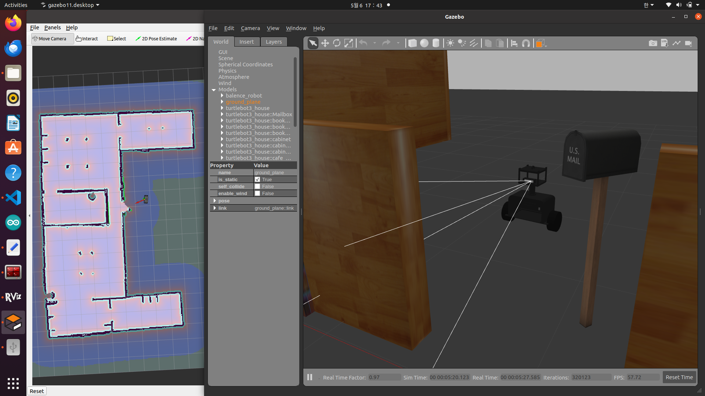

# Route navigation through the balancing controller

[한국어](../../ko/troubleshooting/supporting/03-ros-command-path.md) | [All troubleshooting](../../troubleshooting.md)

> In simulation, `move_base` output becomes motion intent. A balancing controller combines it with IMU/odometry feedback before publishing final `/cmd_vel`.

## Motion requests and attitude recovery share the wheels

Navigation asks for velocity toward a destination. A two-wheeled balancing robot also uses wheel motion to recover its body. Sending high-level velocity straight to the base can bypass the layer that reconciles those requirements.

This case concerns command architecture, rather than a separately recorded hardware failure.

## Navigation output was redirected first

[move_base.launch](../../../ros_ws/src/navigation/launch/move_base.launch) defaults its output destination to `/before_vel`:

```xml
<arg name="cmd_vel_topic" default="/before_vel" />
```

```xml
<remap from="cmd_vel" to="$(arg cmd_vel_topic)"/>
```

That topic carries target speed/turn input for the balancing controller rather than final base output.

## The balancing layer adds robot state

The [LiDAR simulation controller](../../../ros_ws/src/balance_robot_control/src/controllers/pid_control_before_vel_lidar.py) separates intent, feedback, and output:

| Topic | Role |
| --- | --- |
| `/before_vel` | Set desired speed/turn input |
| `/odom` | Update current speed |
| `/imu` | Calculate attitude and update control output |
| `/cmd_vel` | Publish calculated base command |

Speed error becomes desired lean, then is compared with actual pitch:

```python
speed_error = self.setpoint_speed - self.current_speed
self.setpoint_angle = self.Kp_speed * speed_error
angle_error = self.setpoint_angle - current_pitch_angle
output_angle = (self.Kp_angle * angle_error + self.Kd_angle * pitch_rate)
```

LiDAR-version control calculations execute in the IMU callback. A `rospy.Rate(200)` declaration alone does not establish a measured 200 Hz control frequency.

## Publisher/subscriber relationships matter more than names

The intended route is `move_base → /before_vel → balance_robot_control → /cmd_vel`. Launch remapping and controller subscriptions/publications together establish the implemented path.



*Public depth-model simulation capture. The excerpts above are from the LiDAR variant; the image/video document the depth workflow.*

The model settings differ, but share the intent/final-output separation. On hardware, Arduino calculates ODrive current requests. Shared architecture and completed physical autonomy are different claims.

## Related code and records

- [move_base.launch](../../../ros_ws/src/navigation/launch/move_base.launch): navigation-output remapping.
- [LiDAR controller](../../../ros_ws/src/balance_robot_control/src/controllers/pid_control_before_vel_lidar.py): intent/state/output relationship.
- [Control package guide](../../../ros_ws/src/balance_robot_control/README.md): model variants and tuning paths.
- [Simulation clip](../../../media/process/simulation_depth_navigation_demo.webm): depth-workflow behavior.
- [Sim2Real scope](../../sim2real.md): physical autonomy remains integration work.

Inspect live publishers/subscribers with `rostopic info /before_vel` and `rostopic info /cmd_vel`. Public demos show simulation behavior, not finished autonomous navigation on the physical robot.
