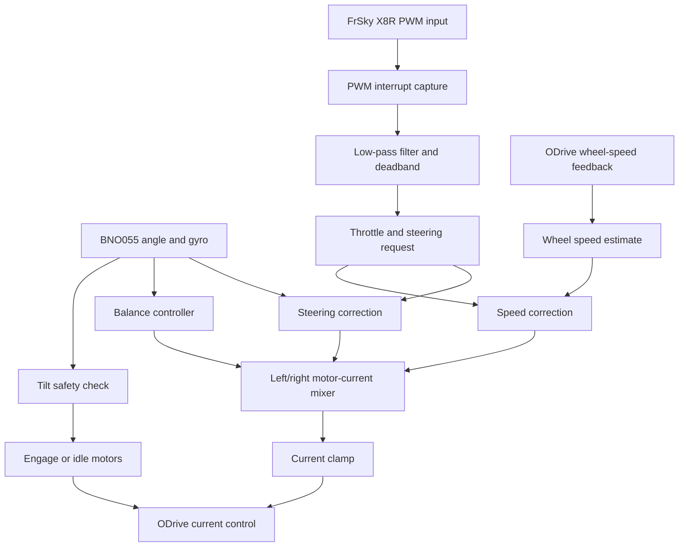

# Physical Balance Control Algorithm

This document explains the structure of the real robot controller implemented in
[`physical_balance_controller.ino`](physical_balance_controller.ino).

The important idea is that the Arduino is not just passing commands through. It is the real-time safety and balance controller. RC input asks for motion, the IMU tells the robot how far it is leaning, ODrive feedback estimates wheel speed, and the final output is a current command to each wheel motor.

## Control Responsibility

| Part | Role in the controller |
| --- | --- |
| FrSky X8R receiver | Provides `throttle`, `steering`, and `engage` PWM signals from the handheld controller |
| BNO055 IMU | Provides body tilt angle, tilt rate, and yaw rate |
| Arduino Mega 2560 | Runs filtering, safety checks, balance control, speed correction, steering correction, and motor-current mixing |
| ODrive 3.6 | Receives current commands and drives the two hub motors |
| Hub motor hall/encoder feedback | Provides wheel-speed information used for speed correction |

## High-Level Flow



## Main Runtime Loop

The Arduino loop is split into small scheduled jobs using `Metro`.

| Job | Code path | Purpose |
| --- | --- | --- |
| Controller update | `LqrController()` then `ApplyMotorCommands()` | Reads sensors, calculates correction terms, sends motor current |
| Activation update | `EngageMotors()` | Uses the filtered engage switch and tilt safety flag to enter or leave ODrive closed-loop mode |
| Optional serial printing | `PrintRcSignals()` | Debug output for raw and filtered RC signal inspection |
| Serial command parsing | `cmd.parse_command()` | Allows gain tuning while the controller is running |

## Input Filtering

The RC receiver values are noisy enough that the controller filters them before use.

```text
filtered_pwm = alpha * raw_pwm + (1 - alpha) * previous_filtered_pwm
```

The sketch uses different filter strengths for different signals:

| Signal | Filter value | Why it matters |
| --- | --- | --- |
| `throttle` | `kAlpha_1 = 0.4` | Smooths forward/backward command without making driving feel too delayed |
| `steering` | `kAlpha_1 = 0.4` | Smooths left/right command |
| `engage` | `kAlpha_2 = 0.02` | Makes motor activation less sensitive to short PWM spikes |

After filtering, throttle and steering use a neutral deadband around the receiver center value. This prevents small stick noise from becoming unwanted motion.

## Safety Layer

The controller has two main safety gates before motors are allowed to stay active.

```text
motors_active = engage_request && !tilt_limit_exceeded
```

| Safety behavior | Implementation detail |
| --- | --- |
| Engage persistence | The engage PWM must remain above the threshold long enough to pass the persistence counter |
| Tilt cutoff | If body tilt exceeds `kTiltDisengageThresholdDegrees = 30`, the controller marks `tilt_limit_exceeded` and exits the balance calculation |
| Integral reset | Balance integral error is reset when motors are inactive or tilt safety is exceeded |
| Current limit | Final current commands are constrained to `-8A` to `+8A` before being sent to ODrive |

## Balance Term

The core balancing term uses the body angle from the BNO055 and the angular velocity from the gyroscope.

```text
theta     = body tilt angle + imu_angle_offset
theta_dot = body tilt angular velocity

balance_controller =
  (K_theta / 100)     * theta
- (K_theta_dot / 100) * theta_dot
+ (Ki / 100)          * integral_error
```

In the code this is named `balance_controller`. It is the term that tries to keep the robot body upright.

## Speed Correction

The controller converts ODrive wheel-speed feedback into estimated linear velocity:

```text
v_left_or_right = motor_direction * wheel_speed * 2 * PI * wheel_radius
```

Throttle input becomes a target speed:

```text
target_speed = throttle_input * maxspeed
```

Then a PID-like speed correction is calculated:

```text
speed_error = target_speed - average_wheel_speed

speed_control =
  kpspeed * speed_error
+ kispeed * integral_speed_error
- kdspeed * derivative_speed_error
```

This term lets RC throttle ask the robot to move forward or backward while the balance term still keeps it upright.

## Steering Correction

Steering combines the filtered receiver steering signal with the IMU yaw rate:

```text
steering_controller = kpSteer * steering + kdSteer * yaw_rate
```

The result is mixed with opposite signs on the left and right motor commands, so the robot can turn while balancing.

## Motor Mixing

The final current request is built from three terms:

```text
motor_0 = balance_controller - speed_control - steering_controller
motor_1 = balance_controller - speed_control + steering_controller
```

Then a small optional `tanh()` compensation term can be added to reduce low-speed bias or friction effects:

```text
motor_0 += adjustment_value * tanh(scaling_factor * wheel_speed_0)
motor_1 -= adjustment_value * tanh(scaling_factor * wheel_speed_1)
```

Finally, both commands are clamped and sent to ODrive:

```text
current_command = constrain(motor_command, -kMaxAbsCurrent, kMaxAbsCurrent)
ODrive.SetCurrent(axis, motor_direction * current_command)
```

## Tuning Interface

The sketch exposes a small serial tuning interface through `Command_processor`.

| Command | Parameter changed | Meaning |
| --- | --- | --- |
| `q` | `K_theta` | Body-angle balance gain |
| `w` | `Ki` | Balance integral gain |
| `e` | `K_theta_dot` | Body angular-velocity gain |
| `r` | `imu_angle_offset` | Mechanical/sensor angle offset |
| `t` | `adjustment_value` | Extra low-speed compensation amount |
| `y` | `scaling_factor` | Shape of the `tanh()` compensation |
| `a` | `kpspeed` | Speed-loop proportional gain |
| `s` | `kispeed` | Speed-loop integral gain |
| `d` | `kdspeed` | Speed-loop derivative gain |

## Why This Structure Matters

A balancing robot cannot treat throttle like a normal wheeled robot. The controller must first keep the body upright, then bias that balance point to create forward/backward motion, and finally add steering as a difference between the two wheels.

That is why the firmware is structured as:

```text
RC request + IMU state + wheel feedback
  -> safety checks
  -> balance correction
  -> speed correction
  -> steering correction
  -> left/right current commands
  -> ODrive
```

This is also why the real robot keeps the low-level control loop on Arduino instead of depending on ROS for balance timing.
