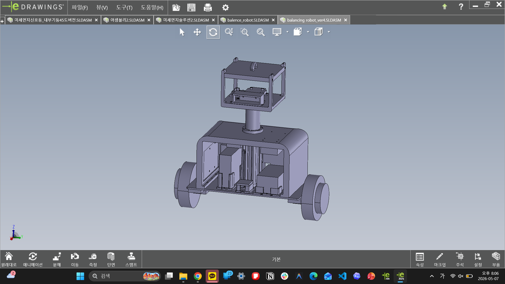
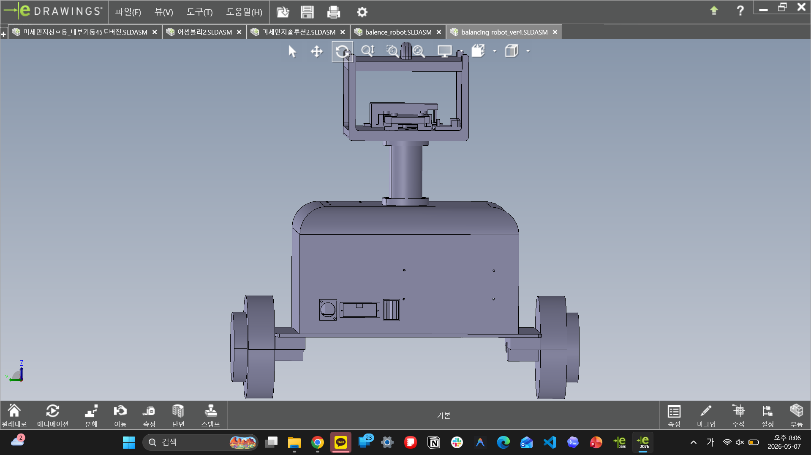

# Mechanical 3D Files

[한국어](README.ko.md) | English

This folder keeps the GitHub-facing 3D files for the robot frame, printable
body parts, and sensor-head structure.

The files were copied from the local modeling archive on 2026-05-11:

- `D:\06_3D_모델링\SLDPRT\balancing robot`
- `D:\06_3D_모델링\SLDPRT\new_balencerobot`

The original file names are preserved where possible so CAD assemblies and
historical references are easier to trace. A few misspellings such as
`balanicng` and `balence` are kept intentionally because they came from the
original project files.

## Folder Roles

| Path | Contents | Use |
| --- | --- | --- |
| `print_ready/` | STL and CATPart exports for the main body package, side plates, board plate, battery plate, breadboard plate, Intel plate, and resistor plate | 3D-print reference and editable part source |
| `head_sensor_mount/` | CATIA/STL files for the neck, inner neck, head versions, Gemini case file (`gemini335_case`), and LiDAR case | Sensor-head and upper frame reference |
| `new_balancerobot_concept/` | Smaller SolidWorks concept assembly, SLDPRT parts, STL, and STEP exports | Later concept/reference geometry |

## Visual Reference

These eDrawings views show the `balancing robot_ver4` assembly that the source
CAD files came from.

<table>
  <tr>
    <td width="50%">
      
    </td>
    <td width="50%">
      
    </td>
  </tr>
</table>

## How This Relates To ROS

The active ROS/Gazebo package still uses the cleaned mesh set in
`ros_ws/src/balance_robot_description/stl/`. Those files are short-name,
simulation-friendly visual assets.

Use this `mechanical/` folder when you need the fabrication-oriented source
files or want to inspect the physical frame design. Use the ROS `stl/` folder
when editing URDF/Xacro visuals.

## Printing Notes

- Re-check scale, orientation, wall thickness, and hole tolerances in your
  slicer before printing.
- No printer-specific G-code is included here. Generate fresh G-code for the
  target printer, nozzle, material, and layer height.
- Collision and inertia in the active ROS models are intentionally simplified;
  these detailed meshes should not be dropped into simulation physics without
  reviewing mass, origin, and collision assumptions.
